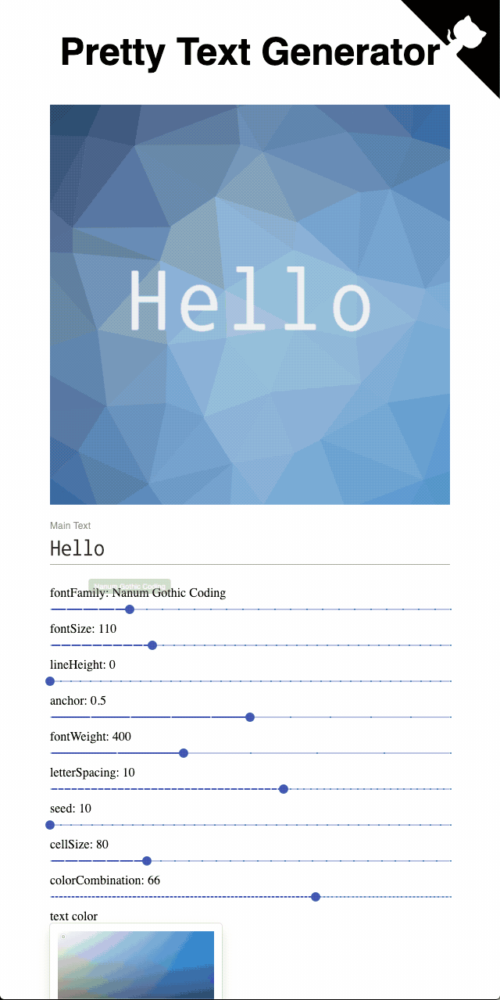

# pretty-text-generator
Create images of pretty letters!



- [Multiline guide](./docs/guide-2.gif)
- [🎉🎉 Live Demo][live_demo]

## Development

```
$ yarn install
$ yarn dev
$ open localhost:3000
```

## Deploy
Deploy your own Next.js project with ZEIT Now.

[](https://zeit.co/new/project?template=https://github.com/aluc-io/pretty-text-generator/tree/master)

## What to do next
- Better UI
- Mobile support
- Error page for Not support browser
- Add API server to share recent history
- Dynamic image resolution

## Contributing
- Feel free to create an issue.
- All pull requests are welcome.
    1. Fork this repository.
    1. Create your new branch. branch naming rule:
        - feat/my-new-feature
        - fix/some-bug
        - docs/fix-typo
        - 13-some-issue (13 is issue No)
    1. Install denpendendies and run development server.
    1. Write your code and commit your changes.
    1. Push to your fork.
    1. Create a new Pull Request to master branch of this repository.

## License
GPLv3 License

[live_demo]: https://pt.aluc.io
